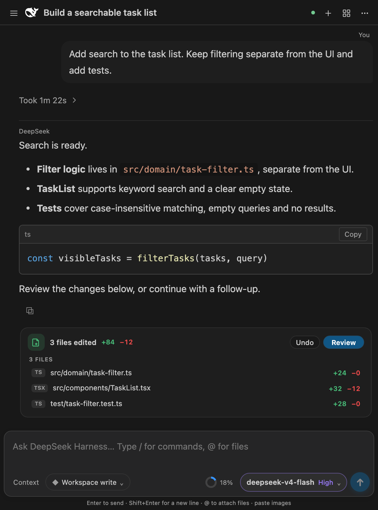
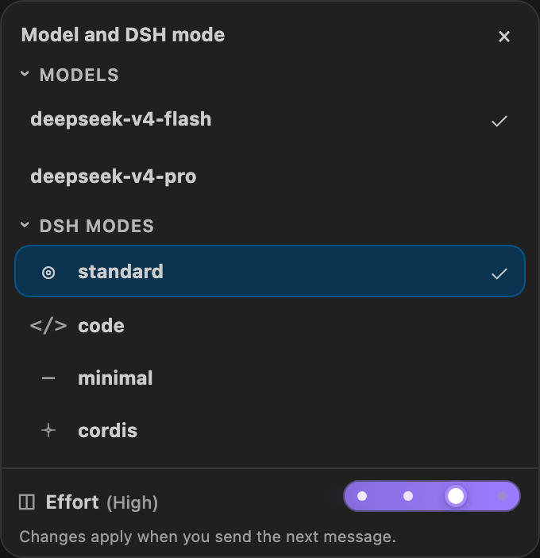
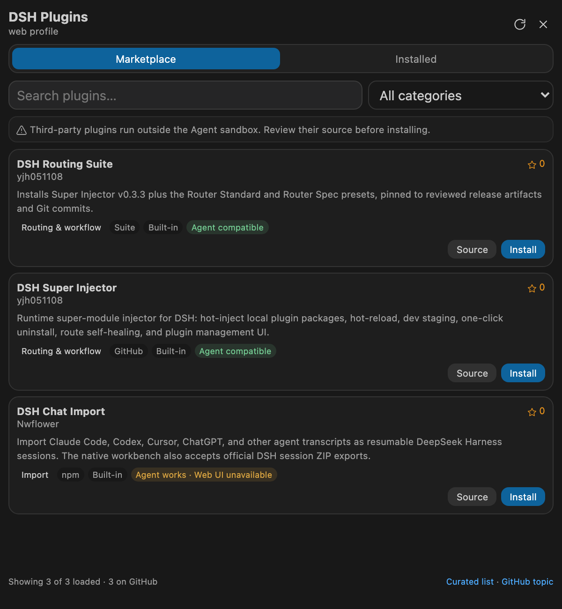

# DeepSeek Harness for VS Code

**English** | [简体中文](README.zh-CN.md)

A native VS Code coding-agent extension powered by [DeepSeek Harness](https://github.com/deepseek-ai/deepseek-harness). Install the platform-specific VSIX and start working—there is no upstream repository to clone, no Node/npm setup, and no local Harness deployment to manage.

> This is the community-maintained **[0.6.1 pre-release](https://github.com/skymecode/deepseek-harness-for-vscode/releases/tag/v0.6.1)**. DeepSeek Harness is currently a Developer Preview, and this extension pins the official `@deepseek-ai/dsh@0.1.7-alpha.1` package (Typert Remote protocol).

> **Runtime upgrade:** Harness now uses session format V4. Supported older logs are migrated on resume into a new generation while their original files are preserved. Old runtimes cannot read the new V4 generation; back up the shared history home (default `~/.dsh`) and the private `~/.dsh/vscode/harness-home` before upgrading, and do not downgrade an active profile. Third-party plugins using the removed `ctx.agent` or runtime `Inbox` APIs need their own compatibility updates. The extension keeps its native VS Code interface rather than embedding the official Web UI.

Startup uses the official runtime package resolver. Only a recognized legacy module conflict triggers one bounded backup-and-repair attempt; ordinary profile packages are no longer moved on every startup or installation.

## 0.6.1 pre-release

This version connects more of the native DSH 0.1.7 services and trims unused runtime resources:

- **Background jobs:** view progress, expand live output, and confirm cancellation from Context → Jobs. Output resumes after reconnects; collapsing cancels observation while live updates retain focus and scroll position.
- **Session management:** native pins, workspace ordering, archive/restore, and activity details before “Stop and archive.” Search includes both active and archived conversations.
- **Schedules:** read-only reminder cards appear in Context → Schedules when the current Profile enables Schedule. DSH tools own creation and deletion.
- **Marketplace recovery:** source failures are visible, successful results stay cached for the current extension session, and reopening retries failed loads. Three built-in recipes are no longer reported as the entire GitHub catalog.
- **Display and compatibility fixes:** completed reasoning shows at least `1s`, cross-platform file links are more reliable, and a native declaration keeps legacy `code` sessions usable.
- **Smaller packages:** unused LibreOfficeKit, official Web document preview and experimental voice payloads are excluded. The local macOS arm64 VSIX is about **88 MiB (92 MB)**, down from about 196 MiB before trimming; other platform sizes vary.

Download a matching VSIX from the [v0.6.1 pre-release](https://github.com/skymecode/deepseek-harness-for-vscode/releases/tag/v0.6.1) and reload VS Code after installation. This pre-release is not automatically published to Marketplace. Release notes for 0.6.1 and 0.6.0 are available in Chinese in the [changelog](CHANGELOG.md).

## Runtime update policy

The bundled DeepSeek Harness runtime is upgraded selectively, not automatically with every upstream release. We review the actual changes—relevant features, bug and security fixes, and breaking changes—and adopt an update after compatibility adaptation and regression testing, with particular attention to Windows, macOS, Linux, existing conversation history, and plugins. The 0.1.7 native capability gap is tracked in [the upgrade audit](docs/DSH_0_1_7_NATIVE_GAP_ANALYSIS.zh-CN.md).

Stability and the upgrade experience for existing users take priority over always bundling the newest version. Releases that still need validation or introduce compatibility risks may be deferred; an extension update may also keep the current pinned runtime. The bundled version and any upgrade caveats are documented in this README and the [changelog](CHANGELOG.md).

## Features

- **Native VS Code workbench** — all interaction happens in the sidebar; the local Harness Gateway exposes only the loopback API transport, while the official WebUI is neither served nor embedded.
- **Shared local history** — the bundled runtime and an independently installed official DSH can read the same saved conversations. Installing the official CLI is optional; credentials and plugin profiles stay separate.
- **Detachable workbench** — open the same synchronized conversation UI in an editor-area panel and move it to another VS Code window when more space is needed.
- **Complete session workflow** — persistent history, create, switch, rename, fork, resume, archive/restore, export, and import sessions (official DSH ZIP, ChatGPT export ZIP, and other agent transcripts via `dsh-chat-import`); changing the DSH mode opens a fresh session in the new mode and carries the previous context as a hidden digest attached to your next message.
- **Streaming Markdown** — headings, lists, tables, code blocks, copy controls, safe external links, and clickable workspace file references.
- **Stable incremental rendering** — streamed updates preserve disclosure state and the reader's scroll position.
- **Progressive reasoning timeline** — nodes appear as thinking steps arrive, connecting only existing steps within the same turn. Completed turns retain their timeline inside the expandable process section.
- **Session titles** — automatic titles and manual renames are owned by the official session service.
- **Per-turn file changes** — official snapshots and historical diffs include shell-driven edits. Old or unavailable snapshots fall back to labeled tool statistics; current workspace changes never stand in for a historical diff.
- **Compact completed turns** — reasoning, tool calls and interim updates fold into a duration row; the final answer and file changes remain visible.
- **Reader-friendly streaming** — while a turn streams you can scroll up through earlier messages freely; auto-follow yields to your scroll and only resumes at the very bottom. The finished conclusion is set off by a divider between the thinking and the final answer (or above the message when there is no thinking).
- **DeepSeek Harness-native reasoning** — reasoning blocks start collapsed with a live summary and can be expanded manually. Streaming retains the chosen disclosure state; completed reasoning shows at least one second.
- **Editor context** — selected code appears as a removable context card; type `@` to fuzzy-search and attach workspace files without leaving the composer.
- **Slash commands** — use official Harness commands plus `/model`, `/reasoning`, and `/preset` extension commands.
- **Harness-native capabilities** — reasoning, tool calls, approvals, structured questions, Todos, Skills, Goals, Plan mode, and background jobs.
- **Model and agent controls** — official catalogs provide model capabilities and reasoning choices; new sessions default to `deepseek-flash`. The PTC preset uses `ptc`; legacy `code` sessions keep a compatible preset.
- **Token usage** — see current input and output token counts in the composer.
- **Native DSH plugin center** — search a curated catalog, filter by category, inspect installed plugins, or install an npm/GitHub/local/tarball package.
- **Automatic localization** — follows the VS Code display language with English and Simplified Chinese support.
- **Zero-deployment runtime** — official `dsh`, pnpm, and standalone Node 22.22.3 are bundled in each platform VSIX and managed by the extension.

Open the workbench with `Ctrl+Alt+H` on Windows/Linux or `Cmd+Alt+H` on macOS.

## Interface preview

Screenshots use the **0.5.9** workbench UI with a demonstration conversation and no private account data. This README shows the English interface; the [Chinese README](README.zh-CN.md#界面预览) shows the localized interface. Select an image to view it at full resolution.

<table>
  <tr>
    <td align="center" width="58%">
      <a href="docs/images/workbench-preview.png">
        
      </a>
    </td>
    <td align="center" width="42%">
      <a href="docs/images/model-and-effort.png">
        
      </a>
    </td>
  </tr>
  <tr>
    <td align="center"><sub>0.5.9 workbench — compact turn process, final answer and per-turn file changes</sub></td>
    <td align="center"><sub>Flash / Pro, four DSH modes and the effort slider</sub></td>
  </tr>
</table>

## Installation

1. Download the VSIX matching your platform from the [0.6.1 pre-release](https://github.com/skymecode/deepseek-harness-for-vscode/releases/tag/v0.6.1).
2. Open the VS Code Extensions view (`Cmd/Ctrl+Shift+X`).
3. Select `...` → **Install from VSIX...** and choose the downloaded file.
4. Reload the VS Code window when prompted.

For example, an Apple Silicon Mac requires the `darwin-arm64` package.

## Quick start

1. Open the project you want to work on.
2. Select the **DeepSeek Harness** icon in the Activity Bar.
3. Open **Connection settings** and configure DeepSeek Official or add a relay source. You can also run `DeepSeek Harness: Set API Key` for the official source.
4. Describe your task in the composer and send it.

No Harness install or start command is required.

## Shared history with official DSH

The extension still ships and starts its own tested Harness/Node runtime. A separately installed CLI is **not required** and is not substituted automatically. On the same machine and OS user account, both backends use the official history location by default:

| Platform | Shared history home |
| --- | --- |
| Windows | `%USERPROFILE%\.dsh` |
| macOS | `~/.dsh` |
| Linux | `~/.dsh` |

An inherited `DSH_HOME` takes precedence. If official DSH uses another home, set the application-level `deepseekHarness.historyHome` to that same absolute path. Only `sessions/` and `attachments/` are shared. The extension's credentials, plugin profile and caches remain under `~/.dsh/vscode/harness-home`; archive and pin state use the native DSH workspace registry in the extension's private home and remain separate from independently launched DSH. Tags and the VS Code history filter stay local to this workbench. VS Code uninstall does not remove the shared history.

Old private/globalStorage histories are migrated through the official session codecs, with the original logs retained. Equal records are not duplicated; a strictly newer compatible prefix is appended only with write ownership. Diverged histories, or newer copies whose destination is busy, become separately named “VS Code history” forks. Completed imports are journaled, so reopening the extension does not keep duplicating them. In-use old sources are deferred; if migration fails, the extension keeps its previous private history for that launch and shows a warning instead of silently starting with an empty migrated store.

Open the VS Code history panel to refresh its list; refresh the official Web UI page to discover externally created history. VS Code filters by the current project, while official DSH may show worktree sessions under their own workspace or as ungrouped sessions. This shares **saved history**, not another process's transient token stream. Kernel locks prevent simultaneous writes to one session: close the owning backend before continuing on the other side, or create a fork. Model credentials and installed plugins are configured independently.

Both runtimes must support the same log format (this build uses **V4, DSH 0.1.7-alpha.1**). An older official CLI cannot read new V4 logs and must be updated to use this sharing feature; original V2/V3 files are retained, but are not a downgrade-sync mechanism. This is not cloud, cross-device, or Windows/WSL cross-kernel synchronization; do not run live shared stores through a network/sync drive. Back up both the shared home and the old private home before a major runtime upgrade.

## DSH plugins

Open the **⊞ Plugins** button in the workbench header to browse repositories read directly from the [`dsh-plugin` GitHub topic](https://github.com/topics/dsh-plugin). Results are merged with [Awesome DSH Plugin](https://awesome-dsh-plugin.com/) metadata for curated categories, localized descriptions, and npm install specs. The **Installed** tab also accepts one package spec directly, including an npm package, `github:owner/repository`, a local path without shell metacharacters, or a tarball URL.

<p align="center">
  <a href="docs/images/plugin-marketplace.png">
    
  </a>
  <br>
  <sub>0.5.9 plugin center — built-in catalog example, not the complete live GitHub marketplace</sub>
</p>

Online results merge GitHub Topic and curated metadata. A network failure names the failed source and retains successful results for the current extension session; use Refresh to retry. A first load without network access or cache shows only three built-in recipes.

Ordinary bundles use the running official Plugin Manager for installation, cancellation, enable/disable and removal. The UI reports read-only, overridden and restart-required results. Bundled Node/pnpm are used without a system package manager. The optional Routing Suite keeps its preset-installation recipe and stopped-runtime CLI path. Super Injector is no longer installed automatically; existing installations are retained.

Host tools, policies, and runtime services contributed by a plugin work in this extension. A plugin may also contain client UI designed specifically for the upstream DSH browser application; those UI contributions cannot be rendered generically by this native VS Code workbench and are marked **Official Web UI**.

Marketplace cards classify known entries as **Agent compatible**, **Agent works · Web UI unavailable**, or **Official Web UI only**. UI-only themes and layout extensions cannot affect the native workbench, so their install button is disabled. GitHub-only entries without curated metadata are marked **Compatibility unknown** until their installed manifest can be inspected.

## Configuration

DSH 0.1.7 uses only Messages for DeepSeek Official, at `https://api.deepseek.com/anthropic`. Old hand-written `llm-deepseek.protocol` options must be removed; Chat Completions endpoints belong under a custom provider. Custom-provider protocols remain unchanged.

OTel, request-attached session logs (`dsh_session_log`) and plugin inventories (`dsh_plugin_packages`) are disabled by default. Normal model requests still contain submitted messages, context and attachments.

Workspace files use official persistent upload receipts for any file type (20 MiB per file, 40 MiB and eight files per submission). Editor selections stay native. Delivered files open in VS Code or an installed format viewer; binary attachments in subagent conversations are not yet supported.

This package excludes the official Web Office/PDF preview and experimental voice payloads, and disables the Office-to-PDF/document-preview profile rows. File uploads, editor opening and DSH file APIs remain available. Restored session terminals and dedicated SSH/Browser Use/Computer Use interfaces still require native workbench integration; installing a Web UI plugin alone does not add them. Experimental permissions are not enabled by upgrading.

| Setting                               | Default             | Description                                                            |
| ------------------------------------- | ------------------- | ---------------------------------------------------------------------- |
| `deepseekHarness.model`               | `deepseek-flash` | Default model for new sessions                                         |
| `deepseekHarness.reasoningEffort`     | `high`              | `off` / `low` / `high` / `max`                                                 |
| `deepseekHarness.agentPreset`         | `standard`          | Default Agent Preset for new sessions                                  |
| `deepseekHarness.provider`            | `deepseek-official` | Default source selected from the extension's Connection settings panel |
| `deepseekHarness.permissionMode`      | `workspace-write`   | `read-only` / `workspace-write` / `danger-full-access`                 |
| `deepseekHarness.autoAttachSelection` | `true`              | Automatically attach the active editor selection when sending          |

Provider endpoints and write-only credential references are managed through the bundled Harness settings and credentials services. API keys are stored in the extension's private Harness home, are never returned to the webview, and are not written to project-level `.vscode/settings.json`. Legacy `deepseekHarness.apiKey`, `baseUrl`, and `providers` values are imported once and then removed.

Use the Connection settings panel to add, edit, test, or remove OpenAI-compatible or Anthropic Messages sources. Custom sources are registered live through the upstream `llm-pi-ai` adapter; test the endpoint to import its advertised model ids, or enter them manually. API keys are optional for local endpoints such as llama-server, llama-swap, and Ollama-compatible servers. Configured providers and their models appear in the model panel grouped by provider.

Model modalities, context windows and reasoning options come from the official LLM resolver. For endpoints that omit context size, enter an explicit override such as `model-id:32k` in Model IDs. Existing model declarations are preserved when editing a provider; an empty new catalog does not invent DeepSeek models. The extension no longer maintains a parallel capacity or vision table.

Automatically attached selections are limited to 16 KB and are truncated when necessary. If the same file selection is already embedded manually, the host will not attach it again.

## Commands

| Command                                              | Description                               |
| ---------------------------------------------------- | ----------------------------------------- |
| `DeepSeek Harness: Open Workbench`                   | Open the sidebar workbench                |
| `DeepSeek Harness: Open Workbench in New Window`     | Open the detachable editor-area workbench |
| `DeepSeek Harness: Reload Workbench`                 | Restart the runtime and reconnect         |
| `DeepSeek Harness: Set API Key`                      | Save the API Key                          |
| `DeepSeek Harness: Clear API Key`                    | Clear the API Key                         |
| `DeepSeek Harness: Show Logs`                        | Open diagnostic logs                      |
| `DeepSeek Harness: Import Sessions`                  | Import a DSH ZIP, ChatGPT ZIP, or other agent transcripts |

## System notifications

Completed foreground and background work now uses **native Windows/macOS notifications**, not VS Code's in-window completion popup. Duplicate idle events, child-agent completions and Stop actions from this extension do not generate extra alerts. Queued prompts notify when the agent becomes idle after finishing the queue; opening old history does not replay notifications. Approval/question prompts remain unchanged.

User settings (effective immediately, without restarting Harness):

```json
"deepseekHarness.systemNotifications.enabled": true,
"deepseekHarness.systemNotifications.sound": false,
"deepseekHarness.systemNotifications.includeConversationTitle": false
```

Run **DeepSeek Harness: Test System Notification** from the Command Palette to test without an API request. Errors are recorded under **DeepSeek Harness: Show Logs**; there is no in-window fallback. Notifications never contain reply text or detailed errors; enabling titles may expose them on the lock screen.

- **macOS:** uses the system AppleScript notification service. Allow notifications/banners for the sender shown in System Settings → Notifications (it may appear as Script Editor/osascript, not a separate Harness app).
- **Windows:** uses Windows PowerShell and Windows Toast with the running VS Code product's AppUserModelID (including Insiders). Use an installed VS Code with its registered Start menu shortcut; portable/custom builds without a registered identity may not show notifications. No registry changes, administrator access or extra notification package is required.
- OS permissions, Focus/Do Not Disturb and enterprise policies can suppress banners even after successful submission. This feature currently requires a **local desktop extension host**; Linux, Remote SSH, WSL, containers and browser-hosted VS Code are not supported. Disconnected runs are not replayed after reconnection.

## Localization

English is the default language, and a Simplified Chinese language pack is included. Manifest contributions, settings, extension-host prompts, errors, and the full chat workbench follow the VS Code display language. After changing the display language, run **Developer: Reload Window**.

## Security and privacy

- The Harness Gateway listens only on a random `127.0.0.1` port.
- The Webview uses a strict CSP and loads no remote scripts or iframes.
- Plugin catalog JSON is fetched by the Extension Host, validated into a narrow UI data model, and rendered with `textContent`.
- Raw Markdown HTML is disabled, and rendered markup is sanitized through a DOMPurify allowlist.
- Remote Markdown images are disabled; http(s) links are validated again by the extension host.
- File and command access is controlled by `permissionMode` and Harness approval policies.
- The API Key is never sent to the Webview or written to extension logs.
- Third-party DSH plugins are trusted Extension Host dependencies: they run outside the Agent sandbox. Review their source before installation.

## Platform support

There is one extension ID and one Marketplace product. Platform-specific VSIX files are required because the bundled Node, PTY, and sandbox packages contain native binaries:

- macOS: `darwin-arm64`, `darwin-x64`
- Linux: `linux-arm64`, `linux-x64`
- Windows: `win32-arm64`, `win32-x64`

The current hosted GitHub Actions matrix builds `darwin-arm64`, `linux-arm64`, `linux-x64`, and `win32-x64`. Other architectures require a self-hosted runner or local packaging.

## Development and packaging

```sh
npm install
npm run check-types
npm run lint
npm test
npm run compile
npm run package
```

`npm run package` creates a VSIX for the current operating system and CPU architecture. `npm ci` executes lifecycle scripts required by native dependencies, so build only trusted commits and lockfiles.

All project commit messages use English. See [`docs/ARCHITECTURE.md`](docs/ARCHITECTURE.md) for the architecture and security boundaries.

## License

Extension code is licensed under the [MIT License](LICENSE). Licensing details for DeepSeek Harness, Node.js, and other dependencies are available in [`THIRD_PARTY_NOTICES.md`](THIRD_PARTY_NOTICES.md) and the license files shipped with each dependency.
