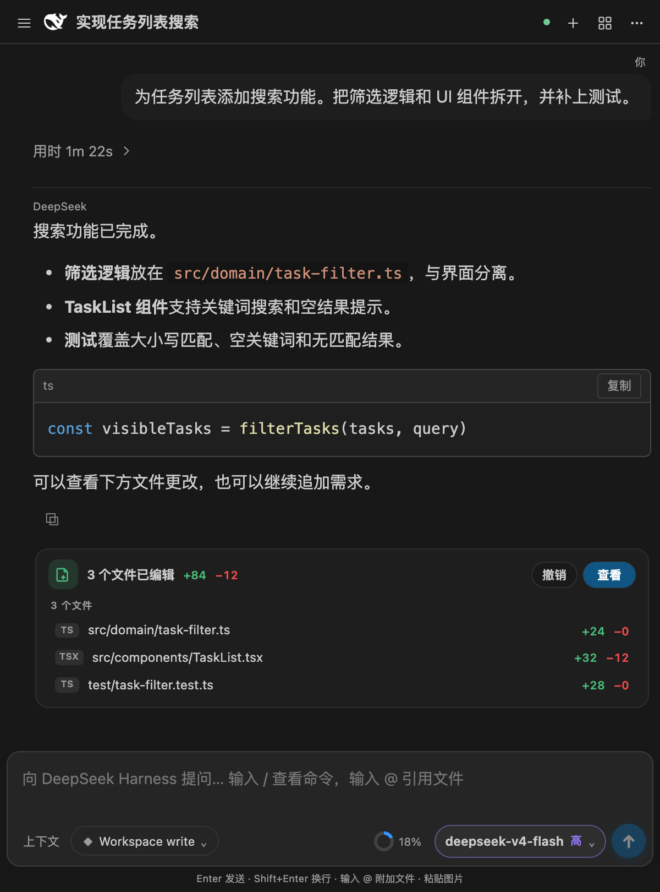
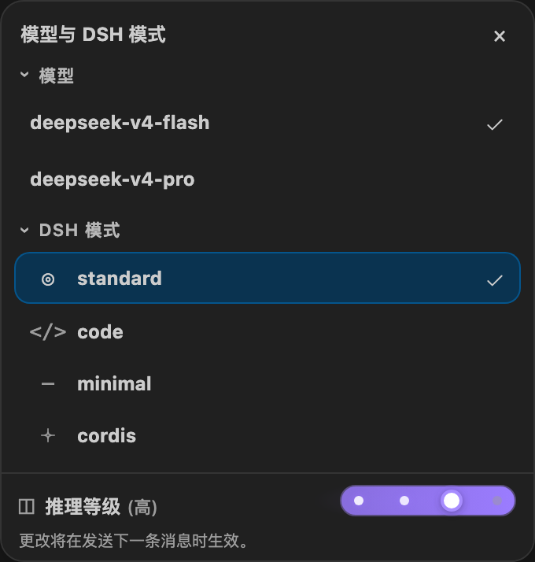
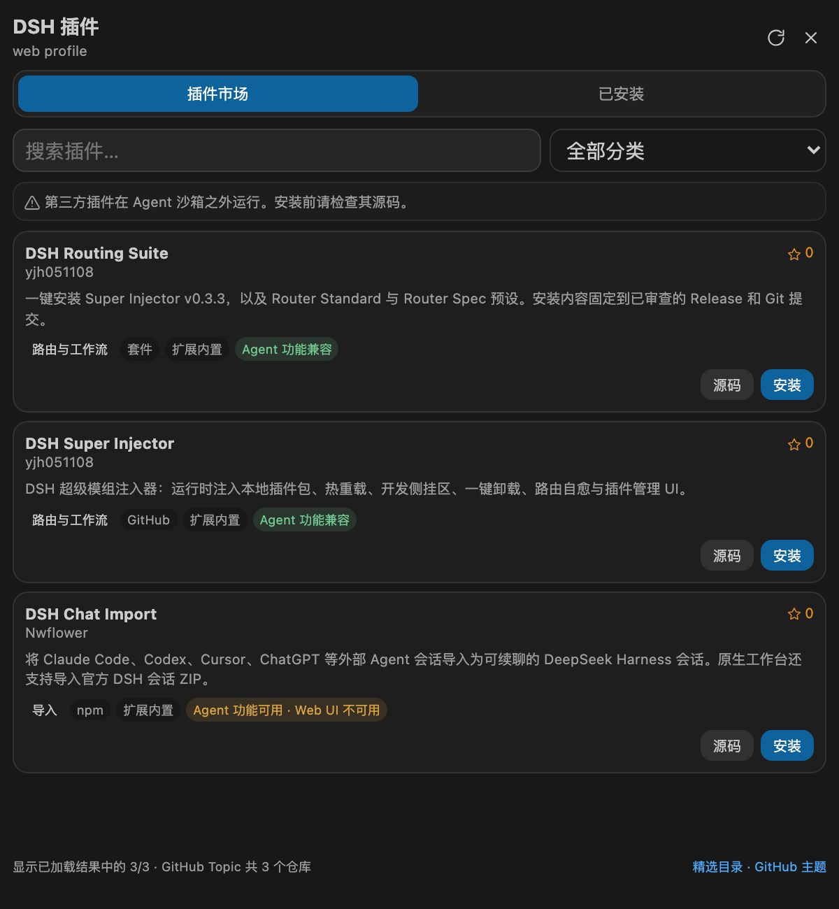

# DeepSeek Harness for VS Code

[English](README.md) | **简体中文**

在 VS Code 中原生运行 [DeepSeek Harness](https://github.com/deepseek-ai/deepseek-harness) 的 AI 编码助手扩展。无需克隆上游仓库、安装 Node/npm 或手动部署 Harness；安装匹配平台的 VSIX 即可使用。

> 当前为社区维护版本 `0.6.0`。DeepSeek Harness 仍处于 Developer Preview，本扩展固定使用官方 npm 包 `@deepseek-ai/dsh@0.1.5-alpha.1`（Typert Remote 协议）。

> **运行时升级提示：** Harness 已采用 V3 会话格式。恢复受支持的旧日志时会生成新一代文件，原文件仍保留；旧运行时无法读取新增的 V3 日志。建议升级前备份 `~/.dsh/vscode/harness-home`，不要对正在使用的配置目录直接降级。依赖已移除的 `ctx.agent` 或运行时 `Inbox` API 的第三方插件需要自行适配。本扩展继续使用原生 VS Code 界面，不嵌套官方 Web UI。

旧安装可能在 Harness 需要托管链接的位置留下普通包目录。启动或安装插件时，扩展现在会自动修复共享 `profiles/node_modules` 中的这类冲突：先将冲突项移入 Harness 数据目录内的 `module-fallback-backup-*`，再由 Harness 重建链接。备份路径记录在输出日志中，正常链接／代理、`profiles/web` 下的插件、会话历史及密钥都会保留，不需要用户执行终端清理命令。如果系统拒绝访问或文件被占用，恢复会安全停止，不删除原数据。

## 功能

- **原生 VS Code 工作台**：全部交互都在侧边栏完成；本地 Harness Gateway 只开放回环 API 传输，不再提供或嵌入官方 WebUI。
- **共享本机历史**：扩展自带的运行时与独立安装的官方 DSH 可读取同一份已保存会话。无需额外安装官方 CLI；密钥和插件配置仍然隔离。
- **可分离工作台**：可在编辑器区打开同步的对话面板，需要更大空间时可将其移到另一个 VS Code 窗口。
- **完整会话管理**：持久化历史、新建、切换、重命名、分支、归档/恢复、导出，以及导入官方 DSH 会话 ZIP、ChatGPT 导出 ZIP 和其他 Agent 会话（通过 `dsh-chat-import`）；切换 DSH 模式时以新模式开启新会话，上一段上下文压缩为隐藏摘要随下一条消息携带。
- **Markdown 流式回复**：支持标题、列表、表格、代码块、一键复制、安全外链及可点击跳转的工作区文件引用。
- **稳定增量渲染**：流式更新保留推理/工具卡展开状态和用户滚动位置。
- **渐进式推理时间线**：推理步骤出现时才创建节点，只连接同一轮已出现的推理步骤；结束后的时间线保留在可展开的过程区内。
- **会话自动命名**：新会话根据首条用户消息自动生成单行标题（去 Markdown 符号、超长截断），手动重命名后不再覆盖。
- **逐轮文件更改**：已编辑卡片跟随各自的结论，恢复历史和继续对话时仍保留正确位置。
- **简洁的已完成轮次**：思考、工具调用和中间说明收进“用时”折叠行，最终结论与文件更改保持可见。
- **阅读友好的流式输出**：对话流式推进时仍可自由上滑查看历史内容——自动跟随会让位于你的滚动，仅在回到最底部后恢复。最终结论通过分隔线与思考块（无思考时位于消息顶部）清晰隔开。
- **DeepSeek Harness 原生推理**：推理以原生 reasoning 块呈现——分片到达时自动展开并跟随最新内容，块完成后自动收起为摘要行。
- **编辑器上下文**：选中代码会显示为可移除的上下文卡片；在输入框键入 `@` 可模糊检索并附加工作区文件。
- **斜杠命令**：支持 Harness 官方命令及 `/model`、`/reasoning`、`/preset` 扩展命令。
- **Harness 原生能力**：推理过程、工具调用、审批、结构化问题、Todo、Skills、Goal、Plan 和后台任务。
- **模型与 Agent 设置**：DeepSeek V4 Flash / Pro、`off` / `low` / `high` / `max` 推理等级和四种官方 Agent Preset。
- **Token 用量**：在输入区显示当前会话输入和输出 Token。
- **原生 DSH 插件中心**：搜索精选目录、按分类筛选、查看已安装插件，或安装 npm/GitHub/本地/tarball 插件包。
- **自动本地化**：根据 VS Code 显示语言自动切换英文或简体中文。
- **免部署运行时**：官方 `dsh`、pnpm 和独立 Node 22.22.3 随平台 VSIX 分发，生命周期由扩展管理。

快捷键：Windows/Linux 使用 `Ctrl+Alt+H`，macOS 使用 `Cmd+Alt+H` 打开工作台。

## 界面预览

以下截图使用 **0.5.9** 工作台界面和示例会话，不包含私人账户数据。此页展示中文界面，[英文 README](README.md#interface-preview) 展示对应英文界面。点击缩略图可查看原始分辨率截图。

<table>
  <tr>
    <td align="center" width="58%">
      <a href="docs/images/workbench-preview.zh-CN.png">
        
      </a>
    </td>
    <td align="center" width="42%">
      <a href="docs/images/model-and-effort.zh-CN.png">
        
      </a>
    </td>
  </tr>
  <tr>
    <td align="center"><sub>0.5.9 工作台 —— 折叠过程、最终结论与逐轮文件更改</sub></td>
    <td align="center"><sub>Flash／Pro、四种 DSH 模式与推理等级滑杆</sub></td>
  </tr>
</table>

## 安装

1. 从 [Releases](https://github.com/skymecode/deepseek-harness-for-vscode/releases) 下载与你的平台匹配的 VSIX。
2. 打开 VS Code 扩展面板（`Cmd/Ctrl+Shift+X`）。
3. 点击右上角 `...` → **从 VSIX 安装...**，选择下载的文件。
4. 按提示重新加载 VS Code 窗口。

例如，Apple Silicon Mac 应选择 `darwin-arm64` 包。

## 快速开始

1. 打开要开发的代码项目。
2. 点击 Activity Bar 中的 **DeepSeek Harness** 图标。
3. 打开“连接设置”，配置 DeepSeek 官方来源或添加中转来源；也可以运行 `DeepSeek Harness: 设置 API Key` 为官方来源保存密钥。
4. 在输入框描述任务并发送。

无需执行任何 Harness 安装或启动命令。

## 与官方 DSH 共享历史

扩展仍自带并启动经过测试的 Harness／Node 运行时，**不要求单独安装官方 CLI**，也不会自动替换成 PATH 中的任意版本。同一台机器、同一系统用户下，两个独立后端默认使用官方历史位置：

| 系统 | 共享历史根目录 |
| --- | --- |
| Windows | `%USERPROFILE%\.dsh` |
| macOS | `~/.dsh` |
| Linux | `~/.dsh` |

继承的 `DSH_HOME` 优先。官方 DSH 使用其他目录时，可在应用级设置 `deepseekHarness.historyHome` 中填写同一个绝对路径。仅共享 `sessions/` 和 `attachments/`；扩展密钥、插件配置与缓存仍保存在 `~/.dsh/vscode/harness-home`，归档、置顶和界面筛选各自独立。卸载 VS Code 扩展不会移除共享历史。

升级时通过官方日志编解码迁移旧私有目录／globalStorage 中的会话，原日志保留：相同记录不重复导入；单边追加的兼容历史仅在获得写权限后补齐；已分叉的历史，或目标正被占用的新副本，会另存为带“VS Code 历史副本”标记的分支。迁移记录避免反复导入。旧来源仍被占用时延后处理；迁移失败时，本次继续显示原私有历史并提示原因，不会静默切换成空历史。

打开 VS Code 的历史面板会刷新列表；官方 Web UI 可刷新页面发现另一端新建的会话。VS Code 默认按当前项目过滤，官方界面可能将 worktree 会话列在独立工作区或未分组列表中。共享的是**已保存的历史**，不是跨进程转发实时 token。同一会话仍受系统写锁保护：关闭持有它的后端后再从另一端继续，或新建分支；两边的模型密钥和插件分别配置。

两个运行时必须支持相同日志格式：本版使用 **V3／DSH 0.1.5-alpha.1**。旧官方 CLI 无法读取新增的 V3 日志，需升级后使用共享功能；保留 V2 原文件不代表支持降级双向同步。这不是云端、跨设备或 Windows／WSL 跨内核同步，请勿通过网络盘／同步盘同时运行共享日志。大版本升级前建议备份共享目录和原私有目录。

## DSH 插件

点击工作台标题栏的 **⊞ 插件**，可以直接浏览 [`dsh-plugin` GitHub Topic](https://github.com/topics/dsh-plugin) 中的仓库。市场结果还会合并 [Awesome DSH Plugin](https://awesome-dsh-plugin.com/) 的精选分类、中文介绍和 npm 安装参数。在“已安装”页可直接输入 npm 包、`github:owner/repository`、不含 shell 元字符的本地路径或 tarball URL。

<p align="center">
  <a href="docs/images/plugin-marketplace.zh-CN.png">
    
  </a>
  <br>
  <sub>0.5.9 插件中心 —— 展示内置目录示例，并非完整的实时 GitHub 市场</sub>
</p>

扩展严格使用官方 `dsh plugin --profile web add/remove` 流程。插件配置保存在 `~/.dsh/vscode/harness-home/profiles/web`；pnpm 修改配置期间 Harness 会安全停止，完成后自动重启。pnpm 已随 VSIX 内置，无需安装系统包管理器。

插件提供的宿主工具、策略和运行时服务可以在本扩展中工作。部分插件还包含专门面向上游 DSH 浏览器应用的客户端 UI，这些界面无法由原生 VS Code 工作台通用渲染，因此会标记为 **官方 Web UI**。

市场卡片会把已知插件标记为 **Agent 功能兼容**、**Agent 功能可用 · Web UI 不可用** 或 **仅官方 Web UI**。纯主题、布局等 UI 插件不能改变原生工作台，因此安装按钮会被禁用；只有 GitHub 元数据、尚未进入精选目录的仓库会标记为 **兼容性未知**。

## 配置

| 设置 | 默认值 | 说明 |
|---|---|---|
| `deepseekHarness.model` | `deepseek-v4-flash` | 新会话默认模型 |
| `deepseekHarness.reasoningEffort` | `high` | `off` / `low` / `high` / `max` |
| `deepseekHarness.agentPreset` | `standard` | 新会话默认 Agent Preset |
| `deepseekHarness.provider` | `deepseek-official` | 在扩展“连接设置”面板中选择的默认来源 |
| `deepseekHarness.permissionMode` | `workspace-write` | `read-only` / `workspace-write` / `danger-full-access` |
| `deepseekHarness.autoAttachSelection` | `true` | 发送时自动附加当前编辑器选区 |

提供商端点与只写凭据引用统一交给内置 Harness 设置/凭据服务管理。API Key 保存在扩展私有的 Harness Home 中，不会回传给 Webview，也不会写入项目 `.vscode/settings.json`。旧版 `deepseekHarness.apiKey`、`baseUrl` 和 `providers` 会在首次连接时迁移并清除。

可在“连接设置”面板中新增、编辑、测试或移除 DeepSeek 中转来源。自定义来源通过上游 `llm-pi-ai` 适配器实时注册，并在模型面板中提供相同的 Flash/Pro 选择。

自动附加的选区最长为 16 KB，超出部分会截断。手动附加同一文件选区后，宿主不会再次自动附加。

## 命令

| 命令 | 说明 |
|---|---|
| `DeepSeek Harness: 打开工作台` | 打开侧边栏工作台 |
| `DeepSeek Harness: 在新窗口打开工作台` | 打开可分离的编辑器区工作台 |
| `DeepSeek Harness: 重新加载工作台` | 重启运行时并重新连接 |
| `DeepSeek Harness: 设置 API Key` | 保存 API Key |
| `DeepSeek Harness: 清除 API Key` | 清除 API Key |
| `DeepSeek Harness: 显示日志` | 打开诊断日志 |
| `DeepSeek Harness: 导入会话` | 导入 DSH ZIP、ChatGPT ZIP 或其他 Agent 会话 |

## 系统通知

当前和后台会话工作结束后使用 **Windows/macOS 原生系统通知**，不再使用 VS Code 窗口内的完成弹窗。重复空闲事件、子 Agent 完成，以及在本扩展中主动停止都不会额外提醒。排队追问在队列处理结束、Agent 空闲时提醒一次；打开历史不会补发通知。审批和提问提示保持原样。

用户设置（立即生效，无需重启 Harness）：

```json
"deepseekHarness.systemNotifications.enabled": true,
"deepseekHarness.systemNotifications.sound": false,
"deepseekHarness.systemNotifications.includeConversationTitle": false
```

在命令面板运行 **DeepSeek Harness：测试系统通知**，无需调用模型即可测试。失败信息写入 **DeepSeek Harness：显示日志**，不会回退到窗口内弹窗。通知不会包含回复正文或详细错误；开启会话标题后，标题可能显示在锁屏上。

- **macOS：** 使用系统 AppleScript 通知服务。在“系统设置 → 通知”中允许对应发送者的通知和横幅（可能显示为 Script Editor／脚本编辑器／osascript，不是单独的 Harness 应用）。
- **Windows：** 使用系统 Windows PowerShell 调用 Windows Toast，读取当前 VS Code 的 AppUserModelID，兼容 Insiders。需要已安装、已注册开始菜单快捷方式的 VS Code；便携版或缺少通知身份的自定义构建可能无法显示。不会修改注册表，无需管理员权限或额外安装通知包。
- 系统权限、专注／勿扰模式、企业策略可能阻止横幅，即使系统提交已经成功。当前仅支持**本地桌面扩展宿主**，暂不支持 Linux、Remote SSH、WSL、容器和浏览器版 VS Code；断线期间结束的工作不会在重连后补发。

## 语言

扩展默认语言为英文，并提供简体中文语言包。命令、设置说明、宿主弹窗和对话工作台都会跟随 VS Code 的显示语言。修改显示语言后执行 **Developer: Reload Window** 即可生效。

## 安全与隐私

- Harness Gateway 只监听 `127.0.0.1` 随机端口。
- Webview 使用严格 CSP，不加载远程脚本或 iframe。
- 插件目录 JSON 由 Extension Host 获取并投影为严格校验的 UI 数据，文字统一通过 `textContent` 渲染。
- Markdown 原始 HTML 默认禁用，渲染结果经过 DOMPurify 白名单净化。
- Markdown 远程图片默认禁用；http(s) 外链会先经扩展宿主校验。
- 文件和命令访问由 `permissionMode` 与 Harness 审批策略控制。
- API Key 不发送给 Webview，也不会写入扩展日志。
- 第三方 DSH 插件属于受信任的 Extension Host 依赖，会在 Agent 沙箱之外运行；安装前请检查源码。

## 平台支持

扩展 ID 和 Marketplace 产品始终只有一个，但由于内置 Node、PTY 和 sandbox 包含原生二进制，需要分别构建平台 VSIX：

- macOS：`darwin-arm64`、`darwin-x64`
- Linux：`linux-arm64`、`linux-x64`
- Windows：`win32-arm64`、`win32-x64`

当前 GitHub Actions 托管矩阵覆盖 `darwin-arm64`、`linux-arm64`、`linux-x64` 和 `win32-x64`。其他架构需要自托管 runner 或本机打包。

## 开发与打包

```sh
npm install
npm run check-types
npm run lint
npm test
npm run compile
npm run package
```

`npm run package` 会根据当前操作系统和 CPU 架构生成对应 VSIX。`npm ci` 会执行原生依赖所需的生命周期脚本，因此请只在可信提交和锁文件上构建。

项目提交信息统一使用英文。架构与安全边界详见 [`docs/ARCHITECTURE.md`](docs/ARCHITECTURE.md)。

## 许可证

扩展代码采用 [MIT License](LICENSE)。DeepSeek Harness、Node.js 和其他依赖的许可信息见 [`THIRD_PARTY_NOTICES.md`](THIRD_PARTY_NOTICES.md) 及各依赖附带的许可证文件。
